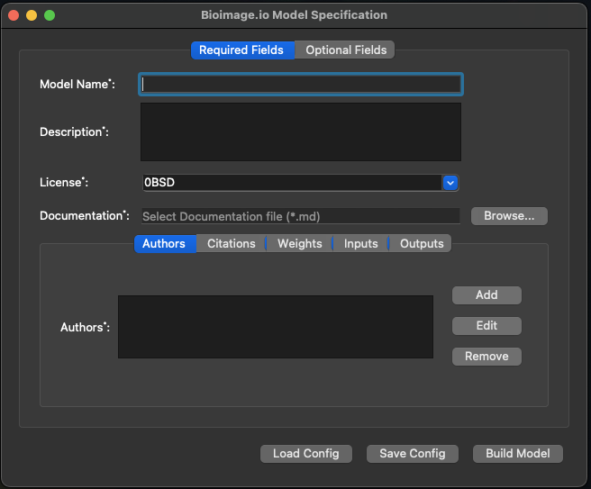

# core-bioimage-io-widgets

[](https://github.com/mese79/core-bioimage-io-widgets/raw/main/LICENSE)
[](https://pypi.org/project/core-bioimage-io-widgets)
[](https://python.org)
[](https://github.com/juglab/core-bioimage-io-widgets/actions/workflows/ci.yml)
[](https://codecov.io/gh/mese79/core-bioimage-io-widgets)

This is a QT UI widget for creating BioImage.io models' specs, and building model.zip files compatible with BioImage model zoo.

### installation
Dependecies:
- PyQt5
- qtpy
- markdown
- PyYaml
- bioimageio.core

To install the project, clone the github repository and install it via pip:
```bash
git clone https://github.com/juglab/core-bioimage-io-widgets.git
cd core-bioimage-io-widgets
pip install -e .
```

To run widget issue this command:
```bash
bioimageio-widget
```

## napari
You can use this widget inside your napari plugin to export your model in a compatible format with the bioimage.io model zoo.  
To do that:
- Import the `BioImageModelWidget` into your plugin's code
- Create a new instance of the imported widget and `show` it!
- Either fill-up the model's specs through the ui or you can pass your model's data to the widget instance via `load_specs` method.
- Finally you can export your model with the `Build` button provided by the widget.  
```python
    from core_bioimage_io_widgets.widgets import BioImageModelWidget

    # Populate the model data dictionary
    # The data format follows the spec-bioimage-io model's rdf:
    # https://github.com/bioimage-io/spec-bioimage-io/blob/gh-pages/model_spec_latest.md
    model_data = {
        "format_version": "0.4.9",
        "type": "model",
        "timestamp": dt.datetime.now().isoformat(),
        "name": "My Model",
        "description": "Some descriptions.",
        "license": "BSD-3-Clause",
        "documentation": "./path/to/file.md",
        "weights": {"keras_hdf5": {"source": str(weights)}},
        "authors": authors,
        "test_inputs": [inputs],
        "test_outputs": [outputs],
        "cite": cite,
        ...
    }

    # Create an instance of bioimage.io core ui widget
    # and pass the model data to it:
    bioimageio_win = BioImageModelWidget()
    bioimageio_win.show()
    bioimageio_win.load_specs(model_data)
```


